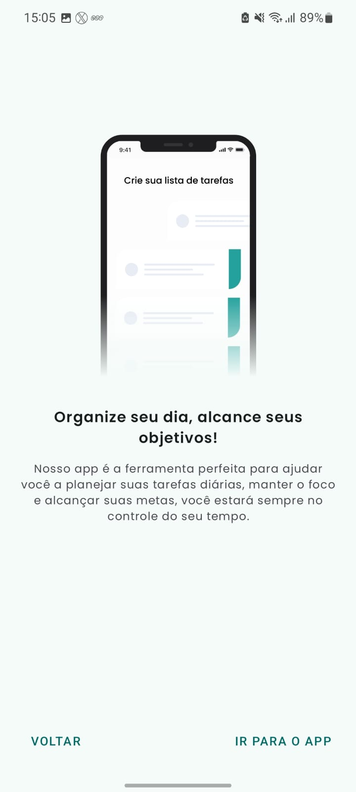
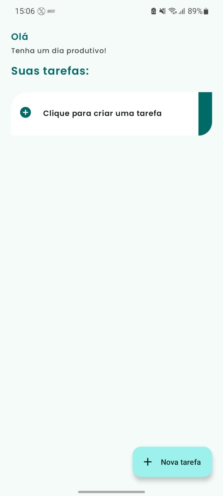
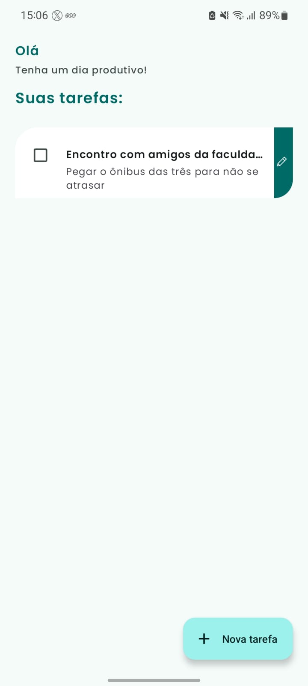
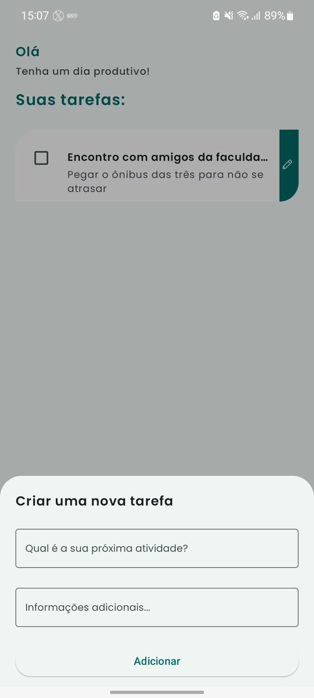
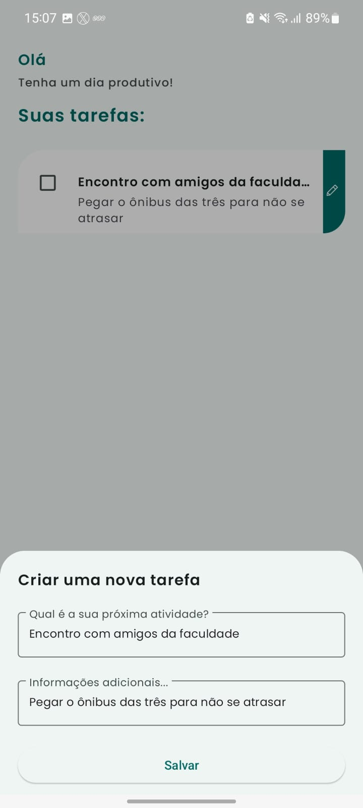

<h1 align="center">ToDo App - MultiModule</h1>

  
  
  

  

⭐ Muitas pessoas enfrentam dificuldades em organizar suas tarefas diárias, o que pode levar a esquecimentos e perda de prazos importantes. Para resolver isso, propomos um aplicativo "ToDo App" simples e prático, que ajuda os usuários a lembrar de suas tarefas de maneira fácil e intuitiva, melhorando a organização pessoal.

### O aplicativo possui duas telas principais:
- #### Tela de Onboarding
  - Exibida apenas uma vez para apresentar rapidamente as vantagens de utilizar o app.
 
- #### Tela Home
  - Onde os usuários podem adicionar, marcar como concluídas, editar e excluir tarefas.

### Considerações Adicionais
#### Com mais tempo, adicionaria:
- Seleção de Data e Hora: Para definir prazos específicos.
- Níveis de Prioridade: Para focar nas tarefas mais importantes.
- Categorias de Tarefas: Para agrupar tarefas por áreas da vida.
- Sistema de Login: Para salvar dados remotamente e acessar de qualquer dispositivo.
  
## Download
Faça o download do <a href="apk/todoapp.apk?raw=true">APK diretamente</a>. Você pode ver <a href="https://www.google.com/search?q=como+instalar+um+apk+no+android">aqui</a> como instalar uma APK no seu aparelho android.
## Tecnologias usadas e bibliotecas de código aberto

- [Linguagem Kotlin](https://kotlinlang.org/)

- Jetpack
  - Navigation Component: O Navigation Component ajuda você a implementar a navegação, desde simples cliques em botões até padrões mais complexos, como barras de aplicativos e a gaveta de navegação.
  - Lifecycle: Observe os ciclos de vida do Android e manipule os estados da interface do usuário após as alterações do ciclo de vida.
  - ViewModel: Gerencia o detentor de dados relacionados à interface do usuário e o ciclo de vida. Permite que os dados sobrevivam a alterações de configuração, como   rotações de tela.
  - ViewBinding: Liga os componentes do XML no Kotlin através de uma classe que garante segurança de tipo e outras vantagens.
  - Custom Views: View customizadas feitas do zero usando XML.

- Arquitetura
  - Modularização com Convention Plugins   
  - MVVM (View - ViewModel - Model) com Clean Architecture
  - Comunicação da ViewModel com a View através de LiveData
  - Comunicação da ViewModel com o model através de UseCases
  - Repositories para abstração da comunicação com a camada de dados.
  - Injeção de dependência com Hilt.

 

## Features

### Onboarding

  
  
  

### Home

  
  
  

  
  

